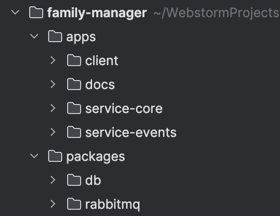

# Git commits

Flow is very similar to https://www.conventionalcommits.org/en/v1.0.0/

Every commit name should be `TYPE(SCOPE): SHORT_SUMMARY` or `TYPE: SHORT_SUMMARY`

## Type

`TYPE` defines the type of change in concrete commit

| TYPE     | Definition                                      |
|----------|-------------------------------------------------|
| feat     | Common used type. Any feature or improvements   |
| fix      | Bugfix                                          |
| build    | Production project build system adjustments     |
| test     | Project tests                                   |
| ci       | CI (GitHub workflows)                           |
| docs     | Documentation update                            |
| refactor | Code refactor with no or minor logic changes    |
| style    | Visual code changes (variable naming, fix typo) |
| chore    | Other                                           |

## Scope

`SPOPE` defines scope of commit, can be optional if changes is global

Scope is equal to app or package names. In case of services `service-*` use name of service (`core` instead of `service-core`) 

## Examples

`feat(core): implement auth` - add auth feature to `service-core`

`refactor(events): Google Calendar integration` - refactor Google Calendar integration in `service-events`

`build: add docker-compose` - add compose file for project build (globally)