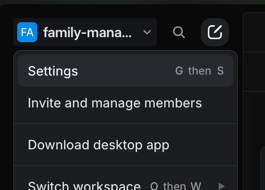
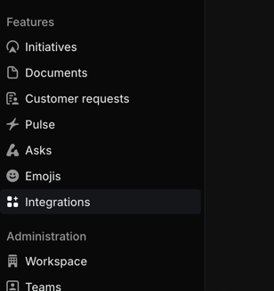
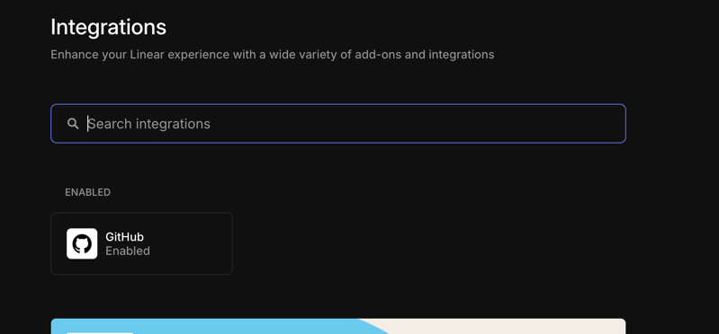
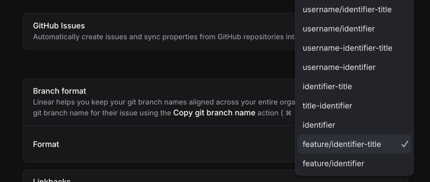
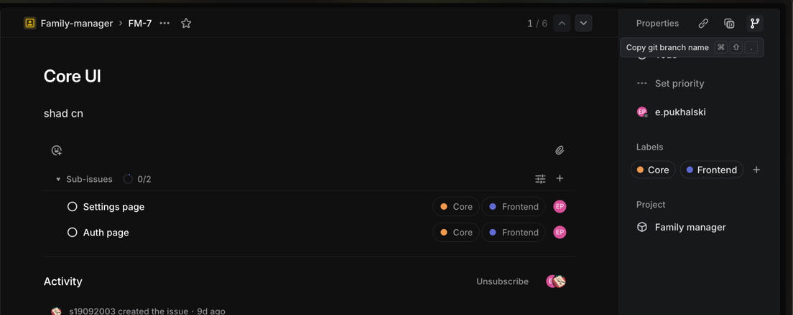
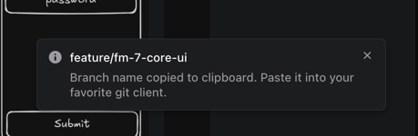
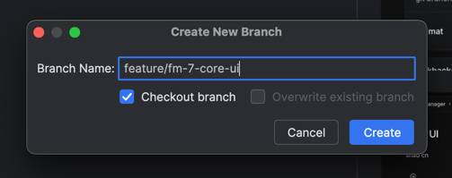

# Linear git setup

For correct branch names you should configure your linear app. Reproduce flow step by step.

Go to settings

Go to GitHub integration

Set value "feature/identifier-title"

After that you can copy branch name from task via button in top right corner

You should use that name for git branches and pull requests

